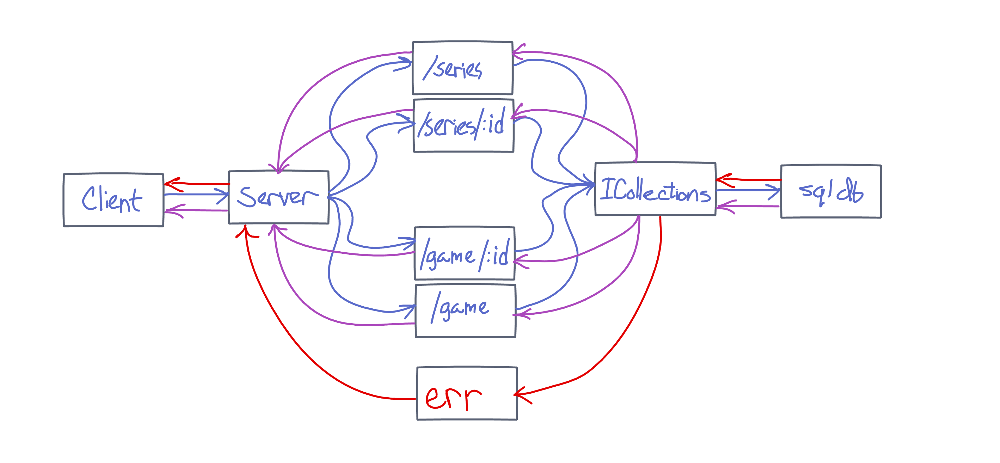

# API Server

Deployed Site: https://api-server-project.herokuapp.com/ 

Latest Pull Request: https://github.com/Micha-L-Davis/api-server/pull/1

## Installation

1. Clone this repository onto your local machine
2. `cd` into `./api-server`
3. Install package dependencies with `npm install`

## Author

Micha Davis

## Routes

* POST : `/series`
    * Parameters: 
        * name 
        * genre
        * installments
    * Response
        * 500 if missing parameter
        * 200 if valid.   

* POST : `/games`
    * Parameters: 
        * name 
        * series id
        * platform
        * year
    * Response
        * 500 if missing parameter
        * 200 if valid.   

* GET : `/series` 
    * Response:
        * 200 and array of series objects

* GET : `/games`
    * Response:
        * 200 and array of games objects

* GET : `/series/:id`
    * Parameters:
        * id (required) 
    * Response:
        * 200 and one specific series object.

* GET : `/games/:id`
    * Parameters:
        * id (required) 
    * Response:
        * 200 and one specific person object.

* PUT : `/series/:id`
    * Parameters:
        * id (required)  
    * Response:
        * 200 and the modified series object

* PUT : `/games/:id`
    * Parameters:
        * id (required)  
    * Response:
        * 200 and the modified games object

* DELETE : `/series/:id`
    * Parameters:
        * id (required)  
    * Response:
        * 200 and the deleted series object

* DELETE : `/games/:id`
    * Parameters:
        * id (required)  
    * Response:
        * 200 and the deleted games object

